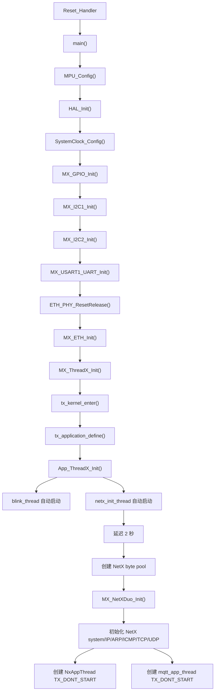
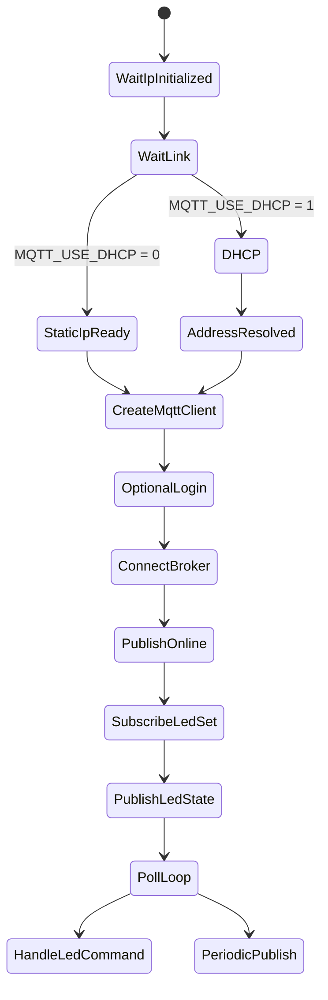

# STM32H750 ThreadX NetX Duo MQTT 工程级审计报告

审计范围：当前 clean 工程目录 `C:\Users\DJ\Desktop\ThreadX_MQTT_H750_Template_clean`。

本报告基于实际工程文件分析，重点依据如下文件：

- `Core/Src/main.c`
- `Core/Src/app_threadx.c`
- `AZURE_RTOS/App/app_azure_rtos.c`
- `NetXDuo/App/app_netxduo.c`
- `NetXDuo/App/app_netxduo.h`
- `NetXDuo/App/nx_user.h`
- `Core/Src/eth.c`
- `MDK-ARM/ThreadX_MQTT_H750_Template.uvprojx`
- `web/led-control.html`
- `tools/mqtt-cloud-bridge.mjs`

## 1. 工程能力总结

当前工程是一个 STM32H750 + Azure RTOS/ThreadX + NetX Duo Ethernet/MQTT 模板工程。它不是裸机工程，也不是 FreeRTOS 工程。运行时通过 `tx_kernel_enter()` 进入 ThreadX 内核，然后在 `tx_application_define()` 中创建应用线程。

当前工程已经包含：

- STM32CubeMX 生成的 HAL 启动和外设初始化代码。
- Azure RTOS/ThreadX 集成代码。
- NetX Duo 源码和应用层 glue 代码。
- STM32 Ethernet HAL 配置。
- ST NetX Duo Ethernet 驱动源码。
- LAN8742 PHY BSP。
- NetX Duo MQTT Client 源码。
- Keil 工程中已经加入 DHCP、DNS、Web HTTP Server、NetX Secure TLS 等源码。
- PC/浏览器侧 MQTT LED 控制页面。
- Node.js 本地静态 WebServer 和 MQTT Cloud Bridge 辅助脚本。

需要特别注意：库源码被加入工程，不等于应用层已经启用这些功能。当前 MCU 固件实际只接通了部分网络/MQTT 路径。

## 2. 工程目录结构

```text
ThreadX_MQTT_H750_Template_clean/
  AZURE_RTOS/
    App/
      app_azure_rtos.c
      app_azure_rtos.h
      app_azure_rtos_config.h
  Core/
    Inc/
      app_threadx.h
      eth.h
      gpio.h
      i2c.h
      main.h
      stm32h7xx_hal_conf.h
      stm32h7xx_it.h
      tx_user.h
      usart.h
    Src/
      app_threadx.c
      eth.c
      gpio.c
      i2c.c
      main.c
      stm32h7xx_hal_msp.c
      stm32h7xx_hal_timebase_tim.c
      stm32h7xx_it.c
      system_stm32h7xx.c
      tx_initialize_low_level.S
      usart.c
  Drivers/
    BSP/Components/lan8742/
    CMSIS/
    STM32H7xx_HAL_Driver/
  FileX/
    App/
      app_filex.c
      app_filex.h
      fx_user.h
  MDK-ARM/
    ThreadX_MQTT_H750_Template.uvprojx
    startup_stm32h750xx.s
  Middlewares/
    ST/
      filex/
      netxduo/
      threadx/
  NetXDuo/
    App/
      app_netxduo.c
      app_netxduo.h
      nx_user.h
    Target/
      nx_stm32_eth_config.h
  tools/
    mqtt-cloud-bridge.mjs
    mqtt-cloud-bridge.md
    static-web-server.mjs
  web/
    led-control.html
```

### 目录职责

| 目录 | 作用 | 类型 |
|---|---|---|
| `Core/Inc`, `Core/Src` | STM32 启动、HAL 外设配置、中断处理、ThreadX 应用入口 | 主要为 CubeMX 生成，含用户修改 |
| `AZURE_RTOS/App` | Azure RTOS glue、静态 byte pool 创建、`tx_application_define()` | CubeMX 生成，含用户修改 |
| `NetXDuo/App` | 用户侧 NetX Duo 和 MQTT 应用代码 | 用户/业务层 |
| `NetXDuo/Target` | STM32 Ethernet 驱动配置 | CubeMX/ST 中间件配置 |
| `Drivers` | CMSIS、HAL、LAN8742 PHY BSP | 厂商代码 |
| `Middlewares/ST` | ThreadX、NetX Duo、FileX、MQTT、DNS、Web HTTP Server、TLS 源码 | 厂商中间件 |
| `FileX/App` | FileX 应用 glue | 已生成但当前停用 |
| `web` | PC/浏览器 MQTT 控制 UI | 用户辅助工具，不是 MCU WebServer |
| `tools` | Node.js 本地 WebServer 和 MQTT 云桥接脚本 | 用户辅助工具 |
| `MDK-ARM` | Keil 工程和构建输出 | 工程/工具链文件 |

## 3. 架构类型判断

当前架构：Azure RTOS / ThreadX + NetX Duo，底层外设由 STM32 HAL 在内核启动前初始化。

判断依据：

- `main()` 调用 `MX_ThreadX_Init()`。
- `MX_ThreadX_Init()` 调用 `tx_kernel_enter()`。
- `tx_application_define()` 实现在 `AZURE_RTOS/App/app_azure_rtos.c` 中。
- 应用线程通过 `tx_thread_create()` 创建。
- 网络栈使用 NetX Duo API，例如 `nx_system_initialize()`、`nx_ip_create()`、`nx_arp_enable()`、`nx_tcp_enable()`、`nx_udp_enable()`。

因此它是 HAL + RTOS 混合初始化架构，但不是多 RTOS 混合架构。

## 4. 启动流程分析

### 启动链路



### 线程关系

| 线程 | 优先级 | 栈大小 | 启动方式 | 当前职责 |
|---|---:|---:|---|---|
| `blink_thread` | 15 | 1024 | `TX_AUTO_START` | 每 1000 tick 翻转一次 `RELAY_Pin` |
| `netx_init_thread` | 16 | 4096 | `TX_AUTO_START` | 延迟后创建 NetX byte pool，调用 `MX_NetXDuo_Init()`，随后挂起自己 |
| NetX IP helper thread | 10 | 1024 | 由 NetX IP 实例创建 | NetX 内部 IP 协议处理 |
| `NxAppThread` | 10 | 1024 | `TX_DONT_START` | 入口为空，当前未使用 |
| `mqtt_app_thread` | 12 | 4096 | `TX_DONT_START` | MQTT 逻辑存在，但线程从未 resume |
| MQTT client 内部线程 | 13 | 4096 | `nxd_mqtt_client_create()` 时由库创建 | 若 MQTT 应用线程运行，则负责 MQTT 内部协议处理 |

### RTOS 对象

当前显式用户/应用对象：

- 线程：`blink_thread`、`netx_init_thread`、`NxAppThread`、`mqtt_app_thread`。
- Byte pool：`tx_app_byte_pool`、`netx_init_byte_pool`；另外生成代码中还有 `fx_app_byte_pool` 和 `nx_app_byte_pool`，但 FileX/默认 NetX 路径已停用。
- Packet pool：`NxAppPool`。
- IP 实例：`NetXDuoEthIpInstance`。
- DHCP Client 对象：`nx_app_dhcp`，但 `MQTT_USE_DHCP 0` 导致 DHCP 默认关闭。
- MQTT Client 对象：`mqtt_client`。

未发现用户自定义的 queue、semaphore、event flags group、mutex 或 application timer。

## 5. 网络协议栈分析

### 已实现的初始化流程

`MX_NetXDuo_Init()` 当前执行：

1. 从 byte pool 分配 MQTT app 线程栈、MQTT client 线程栈、MQTT client 内存。
2. 调用 `nx_system_initialize()`。
3. 分配并创建 `NxAppPool`。
4. 分配 IP helper thread 栈。
5. 使用 `nx_stm32_eth_driver` 创建 `NetXDuoEthIpInstance`。
6. 分配 ARP cache。
7. 启用 ARP。
8. 启用 ICMP。
9. 启用 TCP。
10. 启用 UDP。
11. 创建 `NxAppThread`，但不启动。
12. 若 DHCP 关闭，则设置静态网关 `192.168.50.1`。
13. 创建 `mqtt_app_thread`，但不启动。

### 网络功能清单

| 功能 | 状态 | 依据 / 说明 |
|---|---|---|
| Ethernet HAL | 部分实现 | 存在 `ETH_PHY_ResetRelease()` 和 `MX_ETH_Init()` |
| ST NetX Ethernet 驱动 | 已加入工程 | Keil 工程包含 `nx_stm32_eth_driver.c` |
| 静态 IPv4 | 已实现 | `192.168.50.50/24` |
| 网关 | 已实现 | `192.168.50.1` |
| ARP | 已启用 | `nx_arp_enable()` |
| ICMP | 已启用 | `nx_icmp_enable()` |
| TCP | 已启用 | `nx_tcp_enable()` |
| UDP | 已启用 | `nx_udp_enable()` |
| DHCP | 已编译/可选，但默认关闭 | `MQTT_USE_DHCP 0` |
| DNS | 源码已加入，但应用未使用 | 未发现 `NX_DNS` 对象或 `nx_dns_create()` |
| MQTT | 应用代码存在，但未启动 | `mqtt_app_thread` 使用 `TX_DONT_START` 创建 |
| TLS | 源码已加入，但应用未启用 | `nx_user.h` 中 `NX_SECURE_ENABLE` 仍被注释 |
| HTTP Server | 源码已加入，但应用未创建 | 未发现 `NX_WEB_HTTP_SERVER` 实例 |

## 6. MQTT 分析

### 设计意图中的 MQTT 流程



### 实际运行状态

上述 MQTT 流程当前不会真正执行。原因是 `mqtt_app_thread` 以 `TX_DONT_START` 创建，工程中没有找到对应的 `tx_thread_resume(&mqtt_app_thread)`。

### MQTT 能力矩阵

| 能力 | 状态 | 说明 |
|---|---|---|
| 创建 MQTT Client | 代码存在 | 调用 `nxd_mqtt_client_create()` |
| MQTT 用户名/密码 | 部分实现 | login API 存在，但宏为空 |
| MQTT CONNECT | 部分实现 | 当前是固定 IPv4 明文 TCP 连接 |
| MQTT TLS connect | 未实现 | 未调用 secure connect |
| KeepAlive | 部分实现 | `MQTT_KEEPALIVE_SECONDS 60`，但依赖线程运行 |
| 发布状态 | 部分实现 | QoS0 publish 代码存在 |
| 发布 LED 状态 | 部分实现 | QoS0 publish 代码存在 |
| 订阅 LED 命令 | 部分实现 | QoS0 subscribe 代码存在 |
| 接收消息 | 部分实现 | 轮询 `nxd_mqtt_client_message_get()` |
| QoS 1/2 | 库支持，应用未使用 | 应用始终传 QoS0 |
| 重连机制 | 未实现 | 失败后挂起线程 |
| Broker 域名 | 未实现 | 使用固定 IPv4 |

## 7. WebServer 分析

当前 MCU 侧没有真正实现 WebServer 应用。

证据：

- Keil 工程中加入了 `nx_web_http_server.c`。
- 未发现 `NX_WEB_HTTP_SERVER` 类型的应用对象。
- 未发现 `nx_web_http_server_create()` 调用。
- 未发现 `nx_web_http_server_start()` 调用。
- 当前没有激活 FileX 媒体/页面托管路径。
- `app_azure_rtos.c` 中 FileX 初始化被注释。

`web/led-control.html` 是 PC/浏览器侧 MQTT WebSocket 页面。它连接到 WebSocket MQTT Broker，订阅：

- `stm32/h750/led/state`
- `stm32/h750/status`

并向以下主题发布命令：

- `stm32/h750/led/set`

这个页面适合作为测试 UI，但它不是由 STM32 固件提供的网页服务。

### Web 功能矩阵

| 功能 | 状态 |
|---|---|
| MCU HTTP Server | 未实现 |
| MCU REST API | 未实现 |
| MCU CGI | 未实现 |
| MCU AJAX endpoint | 未实现 |
| MCU JSON/cJSON 处理 | 未实现 |
| 浏览器 MQTT 控制页面 | 作为 PC 侧辅助工具已实现 |
| 实时刷新 | 通过浏览器 MQTT 消息实现，不是通过 STM32 HTTP |

## 8. RTOS 健康度评估

### 优点

- 网络初始化被延迟到 ThreadX 线程中执行，因此链路/网络问题不会直接阻塞内核启动。
- `blink_thread` 可以作为调度器存活指示。
- ThreadX 已启用 `TX_ENABLE_STACK_CHECKING`。
- `netx_init_thread_step`、`nx_app_init_step`、`nx_app_mqtt_status` 等调试变量有利于板级 bring-up。

### 风险

| 风险 | 等级 | 说明 |
|---|---|---|
| MQTT 线程从未启动 | 高 | 主 MQTT 逻辑不可达 |
| 错误处理直接挂起线程 | 高 | 网络/MQTT 失败会变成终止状态 |
| 没有网络事件状态机 | 中 | link down/up、IP 更新、重连未建模 |
| 没有 queue/event flags | 中 | 当前设计依赖轮询和直接调用 |
| `NxAppThread` 为空 | 中 | 创建但未使用，浪费栈并混淆职责 |
| 栈大小未验证 | 中 | 未来 MQTT/TLS 路径需要更大栈和内存 |
| 优先级设计未压测 | 中 | NetX IP helper 为 10，MQTT app 为 12，MQTT 内部线程为 13，初看可用但未验证负载场景 |
| 无看门狗策略 | 中 | 工业可靠性路径缺失 |

## 9. 内存分析

根据 Keil map 文件：

| 项目 | 大小 |
|---|---:|
| Total RO size | 约 76.56 KB |
| Total RW + ZI RAM | 约 149.54 KB |
| Total ROM size | 约 76.72 KB |

关键静态/应用分配：

| 对象 | 大小 |
|---|---:|
| `TX_APP_MEM_POOL_SIZE` | 32768 B |
| `FX_APP_MEM_POOL_SIZE` | 4096 B |
| `NX_APP_MEM_POOL_SIZE` | 98304 B |
| `blink_thread_stack` | 1024 B |
| `netx_init_thread_stack` | 4096 B |
| `mqtt_app_thread_stack` | 4096 B |
| `mqtt_client_stack` | 4096 B |
| `mqtt_client_memory` | 2048 B |
| `NxAppPool` | `(1536 + sizeof(NX_PACKET)) * 16`，约 25 KB 级别 |
| ARP cache | 1024 B |
| NetX IP helper stack | 1024 B |

### 内存风险

- `MQTT_CLIENT_MEMORY_SIZE 2048` 对严肃 TLS/云 MQTT 路径明显偏小。
- TLS 需要 metadata buffer、packet buffer、受信 CA 证书、remote certificate buffers，并且通常需要更充足的 packet pool 余量。
- 如果后续加入 MCU 侧 WebServer，不建议把完整网页大块复制到 RAM。
- 当前 Flash 占用较小，但 Keil 工程已经包含大量 TLS/crypto 源码；一旦 TLS 路径被实际引用，最终链接体积可能明显上升。

## 10. 代码质量评估

评分：5.5 / 10。

### 优点

- 工程结构偏 bring-up 友好，容易调试。
- NetX 初始化路径有 step/status 调试变量。
- Ethernet DMA 描述符对齐信息可见。
- MQTT topic 设计意图简单清晰。

### 问题

- IP、网关、Broker、Topic、用户名、密码硬编码。
- MQTT 线程创建后没有启动。
- `NxAppThread` 为空且没有启动。
- 错误处理经常直接挂起当前线程，缺少恢复机制。
- 没有统一日志接口。
- 没有正式的网络/MQTT 状态机。
- PC 辅助 Web/Cloud 逻辑与 MCU 固件逻辑边界不够清晰。
- FileX pool 存在，但 FileX 功能已停用。
- DNS/TLS/WebServer 源码被加入工程，但应用层没有接入。

## 11. HiveMQ Cloud 直连能力评估

目标：STM32 直接连接 HiveMQ Cloud。

HiveMQ Cloud 直连 MQTT 通常要求：

- 解析 HiveMQ 集群域名。
- 使用 8883 端口 TLS。
- TLS SNI 匹配 HiveMQ hostname。
- 配置 CA trust anchor。
- 用户名/密码认证。
- MQTT keepalive 和重连机制。

### 能力差距表

| 层级 | 当前状态 | 需要补齐 |
|---|---|---|
| TCP | 部分实现 | 启动 MQTT 线程并验证真实 socket 连通性 |
| DNS | 未实现 | 增加 `NX_DNS`、DNS server 配置、hostname lookup |
| TLS | 未实现 | 启用 `NX_SECURE_ENABLE`，提供 TLS setup callback |
| MQTT CONNECT | 部分实现 | 将明文 IP connect 替换为基于 hostname 的 secure connect |
| MQTT AUTH | 部分实现 | 配置真实用户名/密码 |
| Publish | 部分实现 | 现有 QoS0 路径可复用 |
| Subscribe | 部分实现 | 现有 QoS0 路径可复用 |
| KeepAlive | 部分实现 | 已配置 keepalive，但需要重连配合 |
| Reconnect | 未实现 | 增加状态机和指数退避 |

### 最小修改方案

1. 在 `MX_NetXDuo_Init()` 成功后启动 `mqtt_app_thread`。
2. 先验证本地明文 MQTT：`192.168.50.1:1883`。
3. 启用 DHCP，或配置有效静态 IP/网关/DNS。
4. 增加 DNS Client 创建和 HiveMQ hostname 解析。
5. 在 `nx_user.h` 中启用 `NX_SECURE_ENABLE`。
6. 增加 TLS buffer、受信 CA 证书和 TLS setup callback。
7. 使用 `nxd_mqtt_client_secure_connect()` 连接 8883 端口。
8. 增加 HiveMQ hostname 的 SNI 配置。
9. 增加重连循环，以及重连后的 publish/subscribe 恢复。

## 12. 后续演进路线

### 阶段 1：最小可运行 MQTT 云连接

修改：

- `NetXDuo/App/app_netxduo.c`
- `NetXDuo/App/nx_user.h`
- 新增 `NetXDuo/App/mqtt_config.h`
- 新增 `NetXDuo/App/mqtt_tls.c`
- 新增 `NetXDuo/App/mqtt_tls.h`

任务：

- 启动 MQTT app 线程。
- 确认本地明文 MQTT Broker 可用。
- 增加 DNS。
- 增加 TLS secure connect。
- 增加 HiveMQ 用户名/密码配置。

风险：

- TLS RAM 占用。
- 证书验证和 SNI 配置。
- TLS 握手期间 packet pool 耗尽。

### 阶段 2：稳定化

新增：

- `net_manager.c/h`
- `mqtt_manager.c/h`
- `led_service.c/h`
- 用 RTOS event flags 表示 `LINK_UP`、`IP_READY`、`MQTT_CONNECTED`。

重构：

- 将硬编码网络/MQTT 常量移出 `app_netxduo.c`。
- 用可重试状态替换失败后永久挂起线程。
- 增加 link-down/link-up 处理。

风险：

- 线程优先级和 packet pool 尺寸需要在重连风暴下验证。

### 阶段 3：工业级优化

新增：

- 看门狗集成。
- 线程栈高水位统计。
- Packet pool 使用率诊断。
- 环形日志缓冲区。
- 故障报告持久化。
- TLS 证书更新策略。

重构：

- 集中管理错误码。
- 增加 metrics 和 health snapshot API。

风险：

- 调试可见性不能过度消耗 RAM。

### 阶段 4：物联网平台化

新增：

- 设备影子/状态模型。
- 结构化 topic schema。
- 远程配置。
- OTA 设计。
- 凭据/证书持久化。
- 生产烧录/设备注册流程。

重构：

- 分离 transport、protocol、device model 和 board control 层。

风险：

- 安全、设备注册、OTA 会成为架构级问题，需要提前设计边界。

## 13. 当前缺陷总结

当前最危险的问题：

1. MQTT 应用线程从未启动。
2. HiveMQ Cloud 无法直连，因为 DNS/TLS/SNI/CA secure connect 都未接入。
3. 尽管 HTTP Server 源码已加入工程，但 MCU WebServer 没有实现。
4. 失败路径直接挂起线程，缺少恢复机制。
5. 网络配置硬编码。
6. 工程包含多个未使用或半接入组件，容易误导后续开发判断。

## 14. 可立即优化项

优先级 1：

- NetX 初始化后 resume `mqtt_app_thread`。
- 删除、启动或补全 `NxAppThread`，不要保留未使用应用线程。
- 用现有静态 IP 路径验证本地 Broker 连通性。

优先级 2：

- 将 MQTT 和网络常量迁移到配置头文件。
- 增加基础重连循环。
- 增加网络/MQTT 运行状态枚举。

优先级 3：

- 增加 DNS Client。
- 增加 HiveMQ TLS secure connect。
- 增大 MQTT/TLS 内存 buffer。

优先级 4：

- 明确 Web 控制到底采用 MCU-hosted HTTP，还是 cloud/browser MQTT。
- 如果选择 MCU-hosted，则实现真正的 NetX Web HTTP Server 路径。

## 15. 工程成熟度评分

| 维度 | 评分 |
|---|---:|
| 架构 | 5 / 10 |
| 网络 | 5 / 10 |
| RTOS | 6 / 10 |
| MQTT | 4 / 10 |
| Web | 2 / 10 |
| 可维护性 | 5 / 10 |
| 工业化程度 | 3 / 10 |

整体判断：当前仍处于 early bring-up/template 阶段。工程具备正确的中间件原料，但应用集成不完整。

## 16. 下一步最推荐开发路线

最推荐的下一步不是先做 WebServer，而是先让 MQTT 路径真正可运行：

1. 启动 `mqtt_app_thread`。
2. 证明本地明文 MQTT publish/subscribe 能工作。
3. 增加重连和状态上报。
4. 增加 DNS。
5. 增加 TLS 和 HiveMQ secure connect。
6. 云 MQTT 稳定后，再决定是否需要 MCU 侧 HTTP/WebServer。

